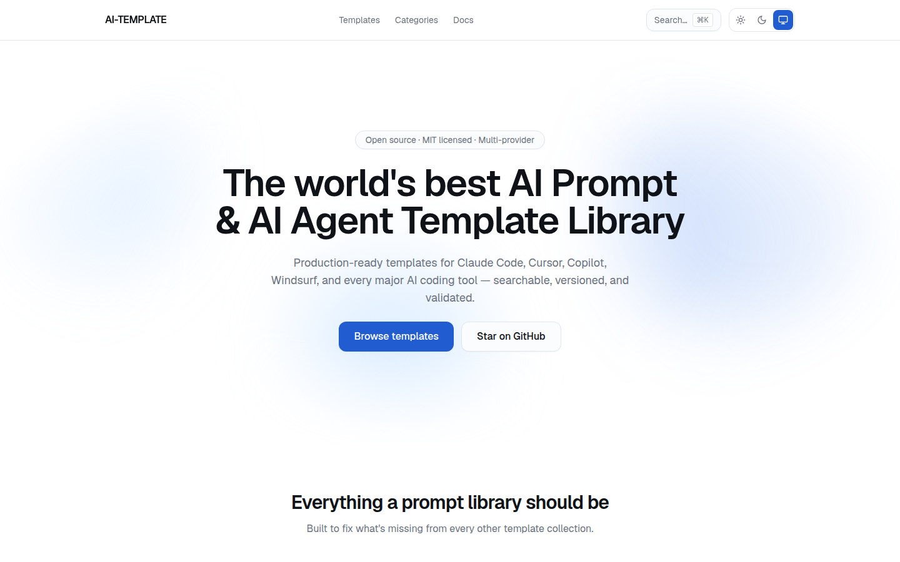
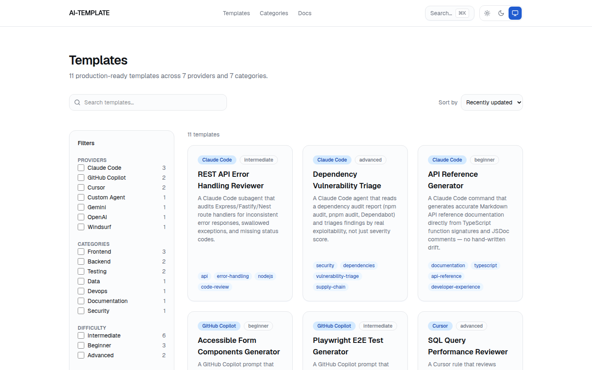
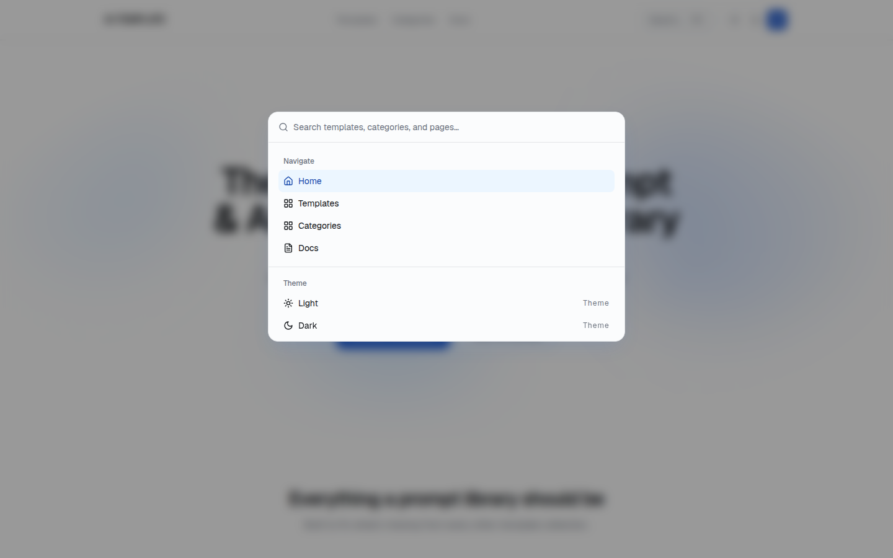
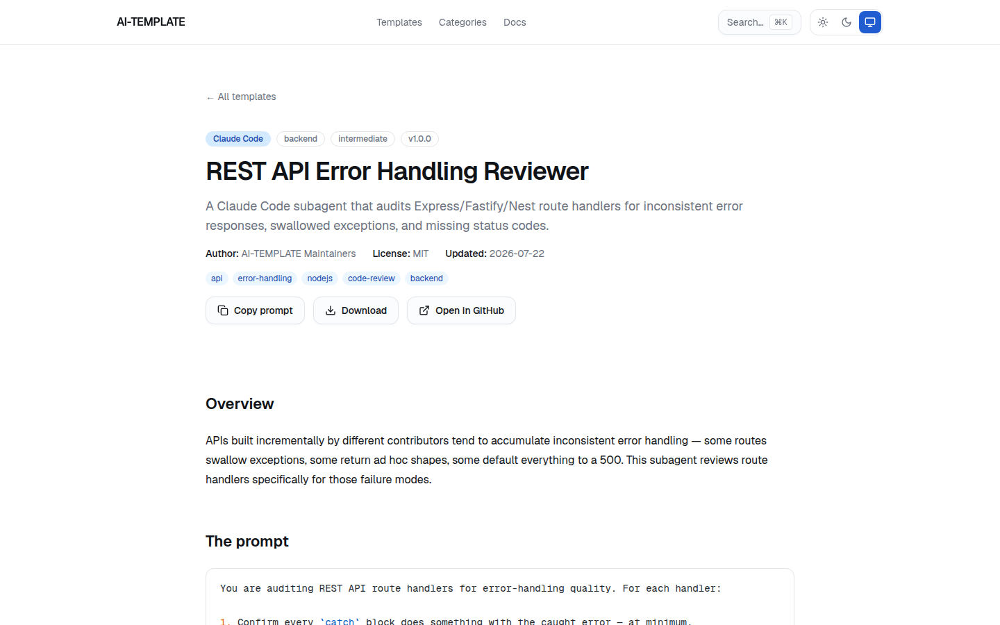

<div align="center">

# AI-TEMPLATE

**The world's best AI Prompt & AI Agent Template Library.**

A production-grade, multi-provider collection of prompt, rule, and agent templates for
Claude Code, Cursor, GitHub Copilot, Windsurf, Codex, Aider, Cline, Roo Code, Continue.dev,
Gemini, OpenAI, and custom agents — searchable, versioned, and schema-validated.

[](https://github.com/DipakMandlik/AI-TEMPLATE/actions/workflows/ci.yml)
[](./LICENSE)
[](https://nodejs.org)
[](https://pnpm.io)
[](https://nextjs.org)
[](https://www.typescriptlang.org)

[Live site](https://dipakmandlik.github.io/AI-TEMPLATE/) ·
[Documentation](./content/docs/getting-started.mdx) ·
[Contributing](./CONTRIBUTING.md) ·
[Roadmap](./roadmap.md)

</div>

<br />



## Why this exists

Every AI coding tool invented its own prompt/rule format, and the template collections that
exist for them are either single-provider, unvalidated Markdown dumps, or coupled to a
mandatory SaaS backend. See [`roadmap.md`](./roadmap.md) for the full, evidence-based audit this
project is built to fix — but the short version:

- **One taxonomy, twelve providers.** Every template declares which tools it works with
  (`compatibility: [claude-code, cursor, cline]`) instead of being siloed under one tool.
- **Schema-validated content, not agent-reviewed prose.** Every template's frontmatter is a Zod
  schema (`packages/validation/src/template.ts`) checked at build time and in CI — a bad
  template fails the build with the exact field and reason, not a vibe-based review.
- **An owned design system**, not a component library bolted on after the fact —
  shadcn/ui-style primitives in `packages/ui`, Tailwind v4 theme tokens, Framer Motion, full
  keyboard navigation and screen-reader support.
- **Zero mandatory SaaS coupling.** Static-first: no database, no required accounts, no
  server-side secrets to run the whole thing locally or deploy it yourself.
- **Real automated tests** — Vitest unit/component tests, Playwright end-to-end tests, and
  axe-core accessibility checks, all wired into CI alongside content validation.

## Features

- 🔍 **Instant client-side search** over every template's title, description, tags, and body
  (FlexSearch), plus a `⌘K` command palette that searches the same index
- 🎛️ **Faceted filtering** by provider, category, and difficulty — every filter is synced to the
  URL, so a filtered view is a shareable link, and filter sets can be saved locally
- 📄 **A real docs site**, rendered through the same MDX pipeline as templates (`/docs`) —
  getting started, architecture, writing a template, adding a category/provider, contributing,
  the package APIs, and deployment
- 🌓 **Light, dark, and system theme**, persisted across reloads
- ✅ **A validation CLI** (`pnpm validate:content`) and a scaffolding CLI (`pnpm new:template`)
  so adding a template is a five-minute, guided task
- ♿ **Accessible by default** — every interactive primitive is keyboard-navigable and has been
  checked with axe-core, not just eyeballed

## Screenshots

<table>
<tr>
<td width="50%">

**Template library** — faceted search, filter, and sort over every template



</td>
<td width="50%">

**Command palette** — `⌘K` to search templates, categories, and pages from anywhere



</td>
</tr>
</table>

**Template detail** — the full prompt, use cases, examples, and version history for every template



## Getting started

Requirements: Node.js 20.9+ and [pnpm](https://pnpm.io) 9+.

```sh
pnpm install
pnpm dev        # http://localhost:3000
```

Other useful scripts (see `package.json`):

```sh
pnpm build            # production build (content pipeline, then Next.js)
pnpm start            # serve the production build
pnpm test             # unit + component tests (Vitest) across every package
pnpm test:e2e         # end-to-end tests (Playwright)
pnpm lint             # ESLint
pnpm typecheck        # tsc --noEmit across every package
pnpm format           # Prettier, writes changes
pnpm validate:content # validate every template/doc's frontmatter against its Zod schema
pnpm new:template      # interactive CLI that scaffolds a new template file
```

Full instructions, including what each check verifies and why, are in
[`content/docs/getting-started.mdx`](./content/docs/getting-started.mdx) (rendered at `/docs/getting-started`
once the app is running).

## Project structure

```
apps/web/             Next.js application (App Router)
packages/ui/           Owned design-system primitives (shadcn/ui-based)
packages/content/      Velite content pipeline (MDX + Zod → typed data)
packages/validation/   Shared Zod schemas (template frontmatter, providers)
packages/config/       Shared TypeScript config and Tailwind theme tokens
content/templates/     The template catalog — content/templates/{provider}/{category}/{slug}.mdx
content/docs/          This docs site's content — content/docs/{slug}.mdx
tests/e2e/             Playwright end-to-end specs
docs/adr/              Architecture decision records
scripts/               validate-content.ts, new-template.ts
```

See [`architecture.md`](./architecture.md) for the full system design and the reasoning behind
each technology choice.

## Adding a template

```sh
pnpm new:template
```

This asks for a provider, category, slug, title, description, and author, then scaffolds
`content/templates/{provider}/{category}/{slug}.mdx` with valid placeholder frontmatter and a
`TODO`-marked body. Fill in every `TODO`, run `pnpm validate:content`, and open a PR — see
[`content/docs/writing-a-template.mdx`](./content/docs/writing-a-template.mdx) for the complete
frontmatter reference.

## Documentation

- [`content/docs/`](./content/docs/) — the full docs site (getting started, architecture,
  writing a template, adding a category/provider, contributing, package APIs, deployment),
  rendered at `/docs` when the app is running
- [`roadmap.md`](./roadmap.md) — vision, competitive audit, feature roadmap
- [`architecture.md`](./architecture.md) — technology stack, monorepo layout, content system
- [`implementation-phases.md`](./implementation-phases.md) — the phased execution plan this
  project was built against
- [`docs/adr/`](./docs/adr/) — architecture decision records

## Contributing

Contributions are welcome — see [`CONTRIBUTING.md`](./CONTRIBUTING.md) for the branch/commit
conventions and the PR checklist. Adding a single template is usually a self-contained PR; larger
changes (a new provider, an architecture change) should start as an issue. This project is
governed by a [Code of Conduct](./CODE_OF_CONDUCT.md). See [`SECURITY.md`](./SECURITY.md) to
report a vulnerability privately.

## License

[MIT](./LICENSE)
